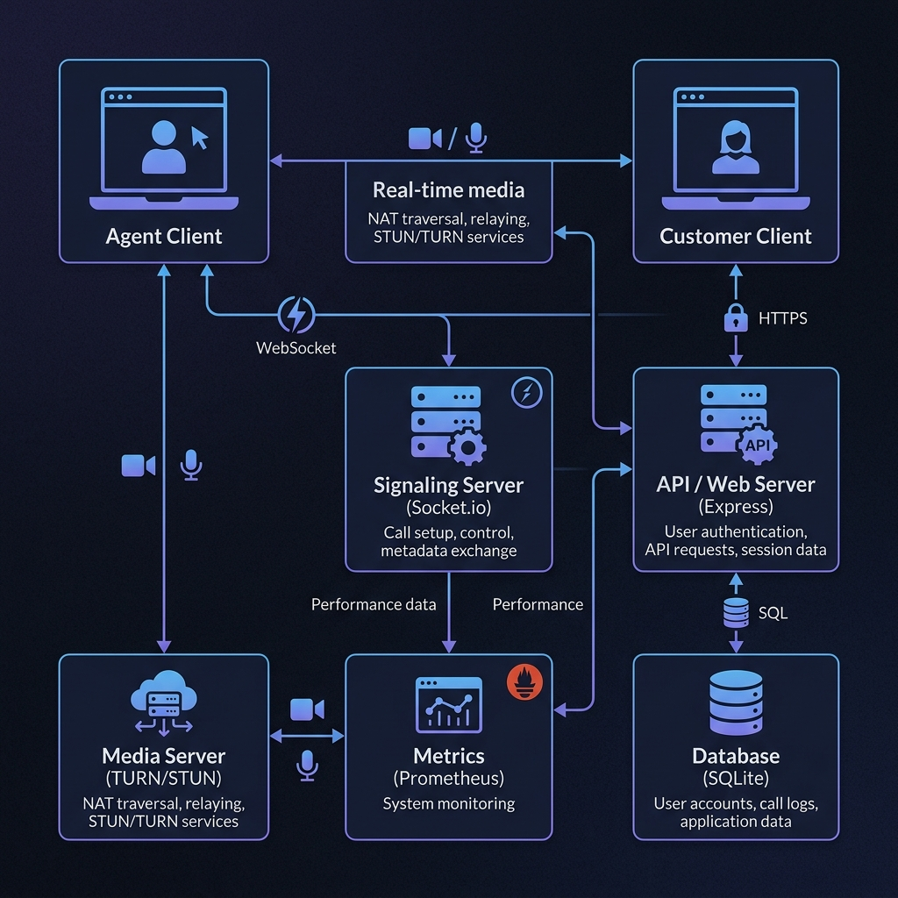

# AtomQuest Real-Time Video Support Platform

Welcome to the AtomQuest Real-Time Video Support Platform. This solution was built from scratch to provide a completely self-hosted, secure, and performant video-calling channel for customer support teams.



---

## 🌟 Key Features

### 1. Session Management (Must-Have)
- **Agent Initialization**: Support agents can create call sessions and generate unique shareable tokens.
- **Join/Invite Link**: Customers can join the support room from a standard web browser with one click (no app installs).
- **Presence Tracking**: Real-time tracking of participants entering and exiting sessions.
- **Clean Disconnections**: All media connections, sockets, and recording states are torn down cleanly when a session is ended.
- **Relational History**: Full session lists (agent, token, timestamps, duration, logs) are written to a SQLite database.

### 2. Audio & Video Calling (Must-Have)
- **RTC Stream Relays**: Built-in **STUN/TURN server** relays all traffic.
- **Forced Media Routing**: WebRTC configuration is locked to `iceTransportPolicy: 'relay'`. Direct Peer-to-Peer connections are blocked, ensuring all media routes through your server.
- **Media Controls**: Real-time microphone mute and camera toggle controls for both participants.

### 3. In-Call Chat (Must-Have)
- **Real-Time messaging**: Instant text chat powered by Socket.io.
- **Chat Persistence**: Full history of sent messages is stored in SQLite and loaded instantly if a participant reconnects.

### 4. Good-to-Have Features (Bonus Points)
- **Call Recording (3.1)**: Support agents can start and stop recordings. The system mixes the local and remote audio/video tracks on the client (using Canvas and Web Audio API), uploads the stream to the server, and transitions status (*in progress* ➡️ *processing* ➡️ *ready*).
- **File Sharing (3.2)**: Upload files directly in the chat panel. Shared files are saved securely on the server and appended to the history list with inline downloads.
- **Reconnect Handling (3.3)**: A 15-second grace window is provided if a connection drops. If a user returns within this window, WebRTC renegotiates silently, preventing call disruption.
- **Operations Admin Dashboard (3.4)**: Real-time telemetry command center showing active sessions, participant information, live audit logs, and a button to *force terminate* any session.
- **Observability Metrics (3.5)**: A `/metrics` endpoint exposes live telemetry (active sessions, connected users, error counts, call durations) in standard Prometheus format.

---

## 🛠️ Technology Stack

1. **Frontend**: Pure HTML5, Vanilla JavaScript (WebRTC APIs, Web Audio API, Canvas, Socket.io client). Styled with premium dark-themed CSS (glassmorphism, micro-animations).
2. **Backend**: Node.js, Express.js.
3. **Database**: SQLite3.
4. **WebRTC Signaling / Chat**: Socket.io.
5. **Media Relay**: `node-turn` (integrated STUN/TURN server running on port 3478).
6. **Multipart Uploader**: `multer` (for shared chat files and call recordings).

---

## 🚀 Getting Started

### 📋 Prerequisites
- Node.js (v18+)
- NPM (v9+)

### ⚙️ Installation
1. Clone the repository or extract the files.
2. Navigate to the project root directory and install dependencies:
   ```bash
   npm install
   ```

### ⚡ Running the App
Start the unified Web and STUN/TURN servers:
```bash
npm start
```

Outputs in terminal:
- `STUN/TURN Server listening on UDP/TCP port 3478`
- `Connected to the SQLite database.`
- `Database tables initialized.`
- `Web server running on https://[LAN_IP]:3000`

---

## 🔑 Login & Routing Reference

| Portal / Page | Endpoint | Description |
| :--- | :--- | :--- |
| **Agent Login & Portal** | `https://localhost:3000/` | Authentication and support session creator dashboard. |
| **Operations Dashboard** | `https://localhost:3000/admin.html` | Live metrics, active sessions list, force termination, and event history. |
| **Observability Telemetry** | `https://localhost:3000/metrics` | Prometheus-compatible metrics stream. |
| **Customer Portal** | `https://localhost:3000/join.html?token=<token>` | Secure join interface (created dynamically by the Agent). |

> [!IMPORTANT]
> **SSL Certificate Warning**:
> Since the server runs on a self-signed HTTPS certificate, when opening the URLs on a local network device for the first time, you will see a browser certificate warning.
> Click **"Advanced"** and then **"Proceed to [IP] (unsafe)"**.
> This is a mandatory browser requirement to establish a **Secure Context** over a LAN connection, which enables microphone and webcam permissions.

### Static Agent Credentials
- **Username**: `agent`
- **Password**: `password`

---

## 🔬 How to Verify Requirements

1. **Forced Media Routing Verification**:
   - Open Chrome and navigate to `chrome://webrtc-internals/` during an active call.
   - Inspect the ICE Candidate pair: only candidates of type `relay` (routing through port `3478`) will be active. No P2P candidate pairs are utilized.
2. **Call Reconnection Test**:
   - Disconnect your network or close a customer call tab.
   - Check the Admin Dashboard: the participant state switches to disconnected but stays holding.
   - Reopen/reconnect within 15 seconds. The connection resumes smoothly without terminating the call.
3. **Observability Verification**:
   - Visit `https://localhost:3000/metrics`.
   - Verify variables like `active_sessions` increment or decrement in real-time as users join/leave.

